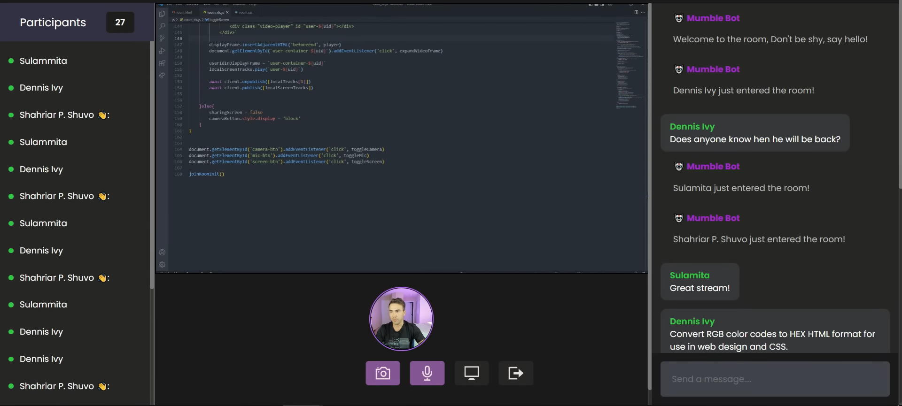

# Virtual Vibe

## Overview
Virtual Vibe is a platform for streaming, sharing screens, group calling, and live chat with friends. It's built using HTML, CSS, JavaScript, and the Agora SDK for live chat video calling.

## Features
- **Live Video Calling**: Conduct live video calls with friends.
- **Screen Sharing**: Share your screen with others during calls.
- **Group Calling**: Have group video calls with multiple friends.
- **Live Chat**: Instant messaging feature for communication.
- **Bot Assistance**: A bot to welcome users and provide notifications.

## How to Use
To use Virtual Vibe, follow these steps:

1. **Open Virtual Vibe**:
   Open the Virtual Vibe website in your browser.

2. **Enter Name and Room ID**:
   - Enter your name in the provided field.
   - Enter the Room ID. Share this Room ID with your friends. They'll use this ID to connect with you through the platform.

3. **Join the Stream**:
   - After entering your name and Room ID, click on the "Join Stream" button.
   - Once you join the stream, you'll be part of the group video call. You can share your video feed and voice with others.
   - If you don't click "Join Stream", you can only see others but can't show your face or talk with them.

4. **Interaction**:
   - During the video call, you can interact with your friends through live video, screen sharing, and live chat.

5. **Bot Assistance**:
   - A bot will welcome you when you join the room.
   - It will also notify you if someone leaves the room or the site.

6. **Leaving the Call**:
   - To leave the group video call, simply close or delete the tab.

## Note
Virtual Vibe is built as a simple and intuitive platform for connecting with friends through live video calls, screen sharing, and chat. The Room ID is crucial for connecting with others, so make sure to share it with your friends.

## Credits
- This project utilizes the Agora SDK for live video calling.

## Support
For any issues or suggestions, please open an issue in the GitHub repository or contact the developer at hanumappa2003@gmail.com.
